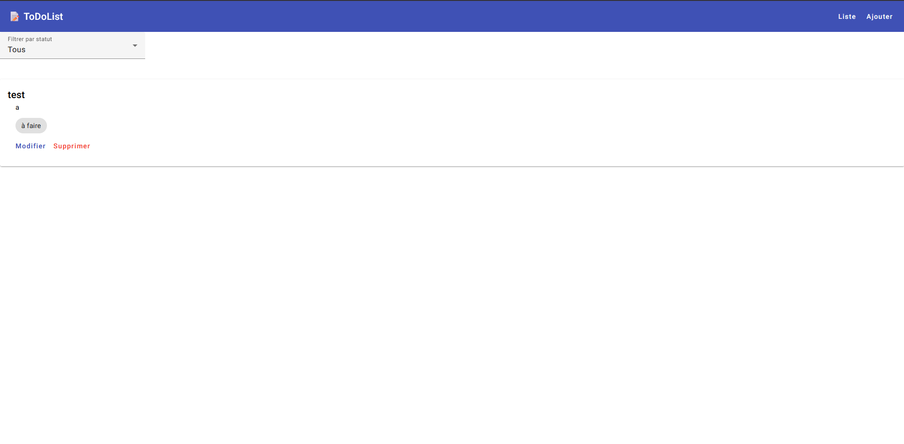

# ToDoList Fullstack CI/CD Project

Projet d’application **ToDoList** mono-utilisateur avec déploiement automatisé sur **Azure Kubernetes Service (AKS)**, conteneurisation Docker, pipelines CI/CD et infrastructure gérée avec **Terraform**.

---

## 🏗️ Structure du projet

```
ci-cd-infra/
├── .github/workflows/           # Pipelines GitHub Actions
├── iac/                         # Infrastructure as Code (Terraform)
├── k8s/                         # Manifests Kubernetes (Deployments, Services, Ingress)
├── projet_devops_backend/       # Backend Node.js + MySQL
│   ├── src/
│   ├── config/
│   ├── controllers/
│   ├── models/
│   ├── routes/
│   ├── services/
│   ├── docs/
│   ├── middlewares/
│   ├── app.js
│   ├── server.js
│   ├── tests/
│   ├── scriptSQL.sql
│   ├── .env
│   ├── package.json
│   └── README.md
├── projet_devops_frontend/      # Frontend Angular
│   ├── src/
│   ├── angular.json
│   ├── package.json
│   ├── Dockerfile
│   ├── README.md
├── monitoring/
├── .gitignore
├── docker-compose.build.local.yml
├── docker-compose.prod.local.yml
└── README.md                    # Ce fichier
```

---

## 🚀 Technologies utilisées

- **Backend** : Node.js, Express, Sequelize, MySQL, Jest + Supertest, Swagger UI  
- **Frontend** : Angular 15, Karma + Jasmine  
- **CI/CD** : GitHub Actions, Docker, Docker Hub  
- **Infra / Déploiement** : Terraform, AKS, Helm, Kubernetes, Ingress NGINX  
- **Monitoring / Logs** : optionnel selon projet

---

## ⚙️ Préparation de l’infrastructure

1. Cloner le dépôt et accéder au dossier `iac/` contenant les fichiers Terraform.
2. Personnaliser les fichiers Terraform pour votre abonnement Azure.
3. Se connecter à Azure :

```bash
az login
```

4. Initialiser et appliquer Terraform :

```bash
terraform init
terraform plan
terraform apply
```

Cela crée le **cluster AKS** et les ressources nécessaires.

---

## 📦 Conteneurisation et Docker

### Dockerfiles

- Backend : `projet_devops_backend/Dockerfile`  
- Frontend : `projet_devops_frontend/Dockerfile`

### Docker Compose local pour tests

```yaml
services:
  mysql:
    image: mysql:8.0
    environment:
      MYSQL_ROOT_PASSWORD: root
      MYSQL_DATABASE: todolist_db
    ports:
      - "3306:3306"
    volumes:
      - mysql-data:/var/lib/mysql

  backend:
    build: ./projet_devops_backend
    environment:
      DB_HOST: mysql
      DB_USER: root
      DB_PASSWORD: root
      DB_NAME: todolist_db
    ports:
      - "3000:3000"
    depends_on:
      - mysql
    command: sh -c "sleep 15 && npm run start"

  frontend:
    build: ./projet_devops_frontend
    ports:
      - "4200:80"
    depends_on:
      - backend

volumes:
  mysql-data:
```

## ⚙️ Démarrage avec Docker Compose

Pour lancer le projet en local avec les images prêtes :

```bash
docker-compose -f docker-compose.prod.local.yml up -d
```

Pour vérifier les conteneurs démarrés :

```bash
docker ps
```

Exemple de sortie :

```
CONTAINER ID   IMAGE                       COMMAND                  STATUS        PORTS
cd21eb24bc27   teralti/todolist-frontend   "/docker-entrypoint.…"   Up 5 seconds  0.0.0.0:4200->80/tcp
885930dadf43   teralti/todolist-backend    "docker-entrypoint.s…"   Up 6 seconds  0.0.0.0:3000->3000/tcp
2ea250094e20   mysql:8.0                   "docker-entrypoint.s…"   Up 6 seconds  0.0.0.0:3306->3306/tcp
```

---

## 🧪 Pipelines CI/CD

### Backend CI

- Test unitaire avec **Jest** + **MySQL service**.  
- Build et push de l’image Docker sur Docker Hub.  
- Context : `projet_devops_backend`.

### Frontend CI

- Test unitaire avec **Angular CLI / Karma / Jasmine**.  
- Build et push de l’image Docker sur Docker Hub.  
- Context : `projet_devops_frontend`.

### Déploiement AKS

- Workflow GitHub Actions déclenché après validation des pipelines frontend & backend.
- Authentification Azure via OIDC.
- Application des manifests Kubernetes dans `k8s/` :
  - Namespace `todolist`
  - Deployments & Services : MySQL, Backend, Frontend
  - Ingress NGINX pour exposer l’application web

---

## 🖥️ Accès à l’application

- **Frontend** : via Ingress NGINX sur le cluster AKS  
- **Backend API** : exposée sur `/api`  
- Documentation Swagger backend : `/api/docs`

---


## ✅ Bonnes pratiques CI/CD et déploiement

- Séparation des workflows **backend / frontend / déploiement**.  
- Déploiement conditionnel uniquement si tests backend et frontend sont réussis.  
- Rolling update AKS via `kubectl rollout`.  
- Utilisation de secrets GitHub pour Docker Hub et Azure.  
- Documentation Swagger générée automatiquement.  
- Dockerfiles optimisés pour build et déploiement rapide.

---

## 📦 Déploiement manuel avec Kubernetes sans passer par GithubAction

### Déployer les manifests

Pour appliquer tous les manifests :

```bash
kubectl apply -f k8s/
```

### Commandes utiles

- Lister les pods :

```bash
kubectl get pods -n todolist
```

- Lister les services et récupérer l’IP publique de l’ingress :

```bash
kubectl get svc -n todolist
```

- Vérifier le rollout d’un déploiement :

```bash
kubectl rollout status deployment/backend -n todolist
kubectl rollout status deployment/frontend -n todolist
```


### Accès via ingress

Manifeste Ingress (`k8s/ingress.yml`) :

```yaml
apiVersion: networking.k8s.io/v1
kind: Ingress
metadata:
  name: todolist-ingress
  namespace: todolist
  annotations:
    nginx.ingress.kubernetes.io/ssl-redirect: "false"
spec:
  ingressClassName: nginx
  rules:
    - host: todolist.local
      http:
        paths:
          - path: /
            pathType: Prefix
            backend:
              service:
                name: frontend
                port:
                  number: 80
          - path: /api/(.*)
            pathType: Prefix
            backend:
              service:
                name: backend
                port:
                  number: 3000
```

---

## 🌐 Configurer l’accès via URL

Pour accéder à `todolist.local`, ajouter l’IP publique de l’ingress dans le fichier **hosts** :

- **Windows** : `C:\Windows\System32\drivers\etc\hosts`  
- **Linux/Mac** : `/etc/hosts`

Exemple :

```
<INGRESS_PUBLIC_IP> todolist.local
```

---

## 🔹 Notes

- L’infrastructure AKS est déployée avec **Terraform** depuis le dossier `iac/`.  
- Les pipelines CI/CD buildent et pushent les images backend et frontend sur **Docker Hub**.  
- Les manifests Kubernetes se trouvent dans `k8s/`.